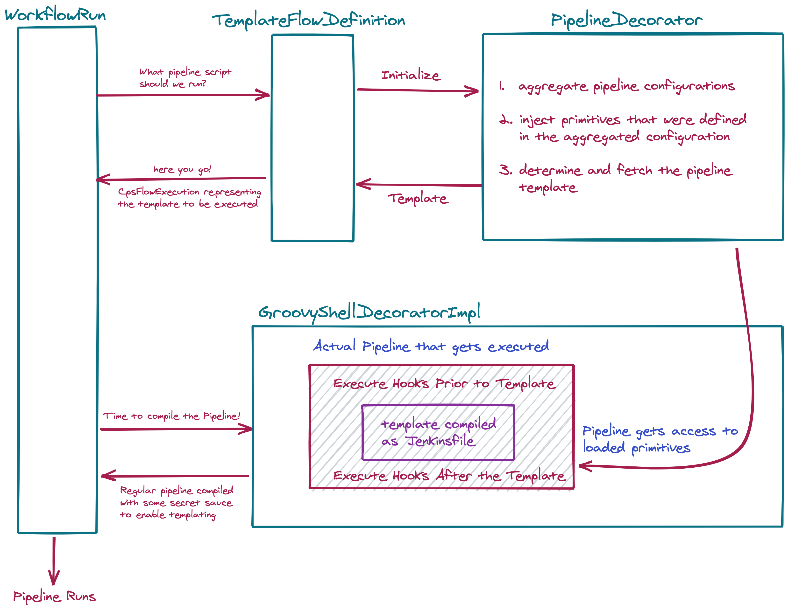

= Jenkins Templating Engine 2.0 

Version 2.0 will cover a few high-level epics: 

* Integration with https://github.com/jenkinsci/workflow-cps-plugin[Pipeline: Groovy Plugin]
* Code Cleanliness
* Feature Development 

== Project Board

Items for the 2.0 release are tracked via https://github.com/jenkinsci/templating-engine-plugin/issues[Issues on the repository] and the 2.0 scope can be seen via the https://github.com/jenkinsci/templating-engine-plugin/projects/2[GitHub Project].

== Integration with Pipeline: Groovy Plugin

=== JTE Initialization (https://github.com/jenkinsci/templating-engine-plugin/issues/87[#87])

==== Pre-2.0 Initialization Process
Until now, JTE's initialization has taken place **after** the pipeline has actually started.  From a code standpoint, that means it was happening within the pipeline as opposed to happening within "plugin" code. This introduced technical complexities associated with the fact that the plugin was limited in the same way that Jenkins pipelines are in regard to CPS. 

This was accomplished by creating a https://github.com/jenkinsci/templating-engine-plugin/blob/1.7.1/src/main/groovy/org/boozallen/plugins/jte/TemplateEntryPointVariable.groovy[TemplateEntryPoint Global Variable] that provided a ``template`` step to Jenkins. This step would then go and compile the https://github.com/jenkinsci/templating-engine-plugin/blob/1.7.1/src/main/resources/org/boozallen/plugins/jte/TemplateEntryPoint.groovy[Entry Point Script] in the resources directory.  Every time a user selected "Jenkins Templating Engine" as the pipeline definition, we hard code that the pipeline simply invoked this template step via ``template()`` as seen https://github.com/jenkinsci/templating-engine-plugin/blob/1.7.1/src/main/groovy/org/boozallen/plugins/jte/job/TemplateFlowDefinition.groovy#L70[Here]. 

This is visible to end users.  When you try to "replay" a Jenkins pipeline that uses JTE what you'll see as the main script is just ``template()``. 

==== 2.0 Updates

The first step to achieving a lot of the feature enhancements users were asking for relies on improving this initialization process. 

JTE 2.0 completely rethinks how to initialize the pipeline.  We have been able to completely remove the ``TemplateEntryPointVariable`` Global Variable. 

Now, all JTE pipelines extend off of a https://github.com/jenkinsci/templating-engine-plugin/blob/2.0/src/main/groovy/org/boozallen/plugins/jte/job/TemplateFlowDefinition.groovy#L52-L58[``TemplateFlowDefinition``] that makes use of an invisible build action called https://github.com/jenkinsci/templating-engine-plugin/blob/2.0/src/main/groovy/org/boozallen/plugins/jte/init/PipelineDecorator.groovy[``PipelineDecorator``] that handles the initialization process for JTE and stores the additions to be injected into the pipeline's runtime environment via a https://github.com/jenkinsci/templating-engine-plugin/blob/2.0/src/main/groovy/org/boozallen/plugins/jte/init/GroovyShellDecoratorImpl.groovy[``GroovyShellDecoratorImpl``]. 

This GroovyShellDecoratorImpl is then responsible for taking the primitives that were created and injecting them into the template's environment prior to execution.  This class also plugs into the compilation process of the template to wrap it in a ``try-finally`` such that JTE's lifecycle hooks can be executed prior to template execution and post template execution. 

 
=== Pipeline Resumability

Some users rely on the resumability of Jenkins Pipelines promised by Jenkins.  Because of how JTE currently works, there is a bug preventing Jenkins from resuming a pipeline managed by JTE. 

As part of https://github.com/jenkinsci/templating-engine-plugin/issues/44[#44], we will be fixing this bug. 

== Code Cleanliness 

As JTE grows in adoption, there is plenty that can be done to improve our ability to collaborate on the code base.  The following tickets are internal-facing changes that will help remediate technical debt, standardize coding styles, and better communicate the software architecture. 

* https://github.com/jenkinsci/templating-engine-plugin/issues/86[Integrate CodeNarc for common styling]
* https://github.com/jenkinsci/templating-engine-plugin/issues/85[Refactor JTE's package structure more logically]
* https://github.com/jenkinsci/templating-engine-plugin/issues/82[Use a Factory pattern for creating StepWrappers]
* https://github.com/jenkinsci/templating-engine-plugin/issues/81[Add JavaDocs throughout the codebase to better communicate the purpose of different classes]
* https://github.com/jenkinsci/templating-engine-plugin/issues/80[Pull Primitive class defintiions out of the resources directory and determine how to recompile with CPS so they work in the pipeline]
* https://github.com/jenkinsci/templating-engine-plugin/issues/79[Standardize on autowired variables - remove the Lifecycle Hook context parameter in favor of an autowired variable]

== Feature Development

* https://github.com/jenkinsci/templating-engine-plugin/issues/72[Document the StageContext functionality to pass arguments to steps run as part of a Stage]
* https://github.com/jenkinsci/templating-engine-plugin/issues/66[Make it possible to exclude steps during library loading if configured by the user]
* https://github.com/jenkinsci/templating-engine-plugin/issues/62[Introduce step namespacing so that multiple steps with the same name can be loaded via a less-strict initialization process configurable by the user]
* https://github.com/jenkinsci/templating-engine-plugin/issues/83[Support arbitrary SCM's by falling back to a heavyweight checkout if the SCM API 2.0 spec is not fully implemented]
* https://github.com/jenkinsci/templating-engine-plugin/issues/84[Improve overall initialization logging for JTE to help users debug issues]
* https://github.com/jenkinsci/templating-engine-plugin/issues/23[Investigate whether or not JTE can integrate with Jenkins Pipeline's Declarative Syntax]

== Get Involved

Feel free to join the https://github.com/jenkinsci/templating-engine-plugin[JTE Gitter Channel] to join the conversation. 

[IMPORTANT]
====
Don't see something you'd lke? Feel free to open an Issue on this repository and let's get the conversation started :)
====
