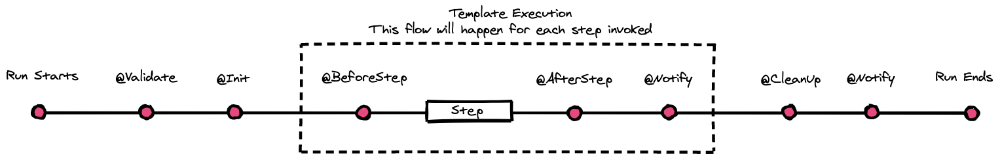

# Lifecycle Hooks

Sometimes it's necessary to trigger specific pipeline actions at certain times during pipeline execution.
For example, if you wanted to send multiple notification types after a particular pipeline step or at the conclusion of a pipeline if the build was failure.

JTE supports this type of Aspect Oriented Programming style event handling through annotation markers that can be placed on methods defined within Library Steps.

## Hook Types

The following lifecycle hook annotations are available:

| Annotation    | Trigger                                                                                                                           |
|---------------|-----------------------------------------------------------------------------------------------------------------------------------|
| `@Validate`   | Beginning of a Pipeline Run, before the Pipeline Template                                                                         |
| `@Init`       | After all `@Validate` hooks, before  the Pipeline Template                                                                        |
| `@BeforeStep` | During template execution, before every [Library Step](/concepts/library-development/library-steps.md)                            |
| `@AfterStep`  | During template execution, after every [Library Step](/concepts/library-development/library-steps.md)                             |
| `@CleanUp`    | After template execution                                                                                                          |
| `@Notify`     | During template execution after every [Library Step](/concepts/library-development/library-steps.md) and after template execution |



## Hook Context

Lifecycle Hook annotations can be placed on any method inside a step.

Every step has an autowired `hookContext` variable which provides steps with relevant information about what triggered the hook.

--8<-- "snippets/hookContext.md"

## Conditional Hook Execution

Sometimes you'll only want to invoke the Hook when certain conditions are met, such as a build failure or in relation to another step (like before static code analysis).

Each annotation accepts a `Closure` parameter.
If the return object of this closure is [truthy](http://www.groovy-lang.org/semantics.html#Groovy-Truth) then the hook will be executed.

While executing, the code within the `Closure` parameter will be able to resolve the `hookContext` variable, the library configuration of the library that loads the step via the `config` variable, and the `currentBuild` variable made available in Jenkins Pipelines.

???+ success "Example Hook Usage"

    ``` groovy title="library_step.groovy"
    @BeforeStep({ hookContext.step.equals("build") })
    void call(){
      // execute something right before the Library Step called build is executed.
    }
    ```

!!! note
    The closure parameter is optional. If omitted, the hook will always be executed.
