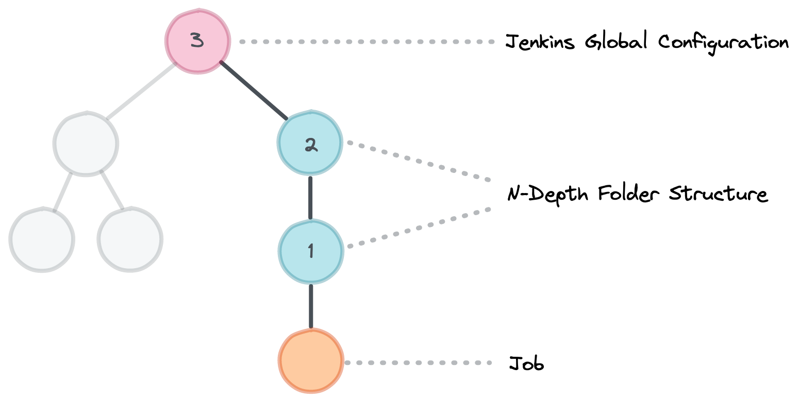
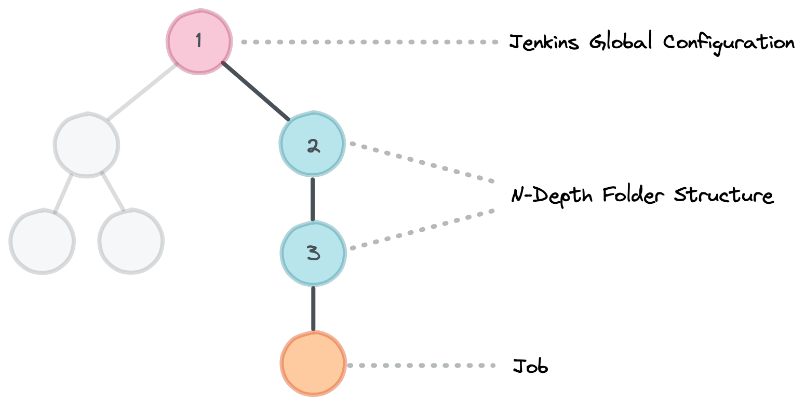

# Library Resolution

Each [Governance Tier](./governance-tier.md) in the [Configuration Hierarchy](./configuration-hierarchy.md) can store a list of [Library Sources](../library-development/library-source.md).

This page explains the order in which JTE will try to resolve and load a Library if multiple Library Sources have the same library.

## Default Resolution Order

{ align=center }

JTE will search for Libraries within Library Sources starting with the Governance Tier most proximal to the Job in the taxonomy.

The Library Sources will be queried for the library starting with the first Library Source in the list on the Governance Tier before proceeding to any subsequent Library Sources.

If the Library Sources configured on the first Governance Tier don't have the Library being loaded, JTE will then check the parent Governance Tier.

If the Library can't be found after searching every Governance Tier, the Pipeline Run will fail.

## Inverting Resolution Order

To invert this resolution order, set `jte.reverse_library_resolution` to `True`.

{ align=center }
