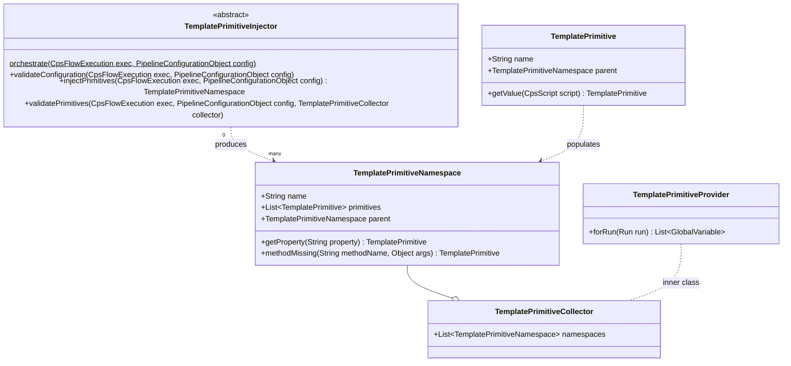
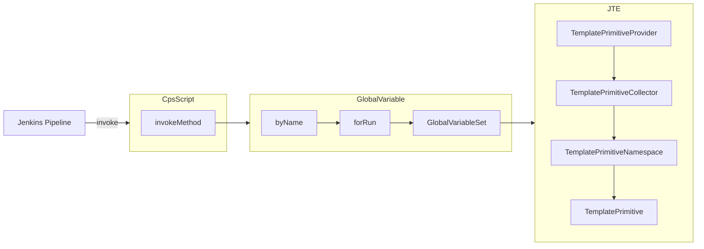
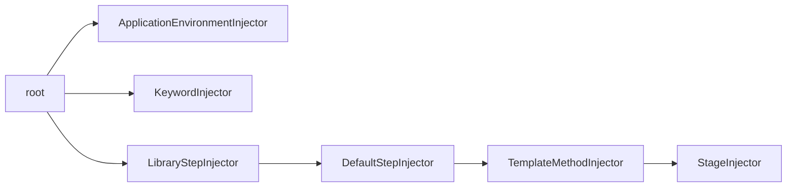

# Inject Pipeline Primitives

## Pipeline Primitives

[Pipeline Primitives](../../concepts/pipeline-primitives/index.md) are objects that can be instantiated and "injected" into a JTE pipeline's execution to create concrete implementations of resources used in a Pipeline Template.

Each primitive extends `TemplatePrimitive` which is a [`Serializable`](https://docs.oracle.com/javase/7/docs/api/java/io/Serializable.html) [`GlobalVariable`](https://github.com/jenkinsci/workflow-cps-plugin/blob/master/src/main/java/org/jenkinsci/plugins/workflow/cps/GlobalVariable.java) to ensure they can be persisted and discovered.

### Primitives That Execute Pipeline Code

Pipeline Primitives that execute pipeline code, such as Library Steps (`StepWrapper`) or Stages (`Stage`), should create a separate class in the resources directory and override the `getValue(..)` method such that what's actually returned to the pipeline is a CPS-transformed class.

## TemplatePrimitiveInjector

Each Pipeline Primitive has a corresponding `TemplatePrimitiveInjector` that's responsible for parsing the Aggregated Pipeline Configuration and populating a `TemplatePrimitiveNamespace` holding the created `TemplatePrimitves`.

### Class Structure

### Functional Interface

There are three phases to Pipeline Primitive Injection that are mapped to three methods a `TemplatePrimitiveInjector` can override.

| Phase                   | Description                                                                                           |
|-------------------------|-------------------------------------------------------------------------------------------------------|
| `validateConfiguration` | Receives the Aggregated Pipeline Configuration so that syntax validation can occur                    |
| `injectPrimitives`      | Where injectors should instantiate Pipeline Primitives based on the Aggregated Pipeline Configuration |
| `validatePrimitives`    | Where validations should occur on the Pipeline Primitives that have been instantiated                 |

### Pipeline Primitive Resolution

These `TemplatePrimitiveNamespace`s are collected in the `TemplatePrimitiveCollector`, which is persisted as an [`InvisibleAction`](https://github.com/jenkinsci/jenkins/blob/master/core/src/main/java/hudson/model/InvisibleAction.java) on the Pipeline Run.

`TemplatePrimitiveCollector`, then, has a subclass called `TemplatePrimitiveProvider` that extends [`GlobalVariableSet`](https://github.com/jenkinsci/workflow-cps-plugin/blob/master/src/main/java/org/jenkinsci/plugins/workflow/cps/GlobalVariableSet.java).

When a Jenkins pipeline tries to resolve a method (in [`CpsScript.invokeMethod()`](https://github.com/jenkinsci/workflow-cps-plugin/blob/master/src/main/java/org/jenkinsci/plugins/workflow/cps/CpsScript.java#L85-L125)) it will check for the `GlobalVariables` available to the run and resolve the Pipeline Primitives that have been created.

## Injector Sequencing

Each `TemplatePrimitiveCollector` can annotate the three methods of Pipeline Primitive Injection with a `@RunAfter` annotation that accepts the `TemplatePrimitiveInjectors` that this injector should run after.

This approach has been easier to handle than ordinals for sequencing the injectors.

When `TemplatePrimitiveInjector.orchestrate()` is called, each phase of Pipeline Primitive Injection is called in sequence.

For each phase, a [Directed Acyclic Graph](https://en.wikipedia.org/wiki/Directed_acyclic_graph) of `TemplatePrimitiveInjectors` is created based on the dependencies defined by `@RunAfter` annotations.

The injectors are then execution in the order determined by the graph.

For example, for the `injectPrimitives` phase, the graph looks like:

