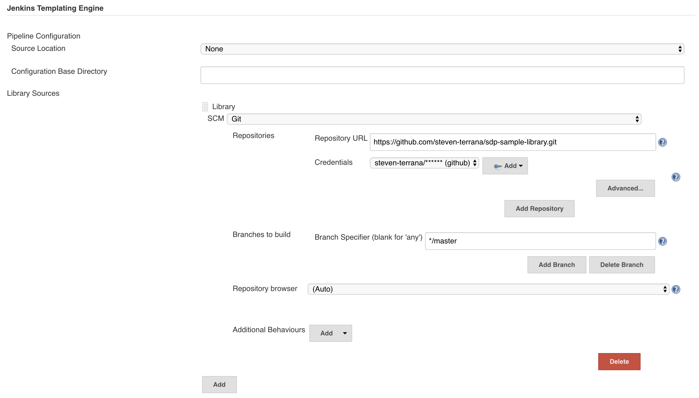

.. _Pipeline Libraries: 

---------------
Library Sources
---------------

Pipeline libraries provide a modular way to organize pipeline code. 

With the Jenkins Templating Engine, templates can invoke steps.  These steps are
typically generically named and are contributed by a pipeline library.  If multiple 
libraries contribute the same step name, they can be swapped in and out of the template's
execution by modifying the pipeline configuration. 

************************************
Library Source Jenkins Configuration 
************************************

Library Sources get configured as part of a :ref:`Governance Tier<Governance Model>`.  Within ``Manage 
Jenkins > Configure System`` you'll find the global Jenkins Templating Engine Configuration:

Under ``Library Sources`` you'll be able to add as many sources as you choose.  

.. important:: 

    A library source is just a pointer to a source code repository containing library modules. 

************************
Library Source Structure
************************

Individual libraries are just directories within the configured library source repository. 

The library is referenceable in your ``pipeline_config.groovy`` file via the directory name. 

Each file within a library directory will be loaded as a step invokable from a pipeline template where
the step name is equal to the base file name. 

*******
Example
*******

Let's say you had a simple pipeline template to support teams using maven and ant as their build tools: 

.. code:: 

    unit_test()
    build()
    package() 
    deploy_to dev 

GitHub Repository called ``jte-lib`` located at ``https://github.com/jte-library-example/jte-lib.git`` 
with the following directory structure: 

.. code:: 

    maven/ 
        build.groovy
        package.groovy
        unit_test.groovy
        README.rst
    ant/ 
        build.groovy
        package.groovy
        unit_test.groovy 
        README.rst
    weblogic/
        deploy_to.groovy
        README.rst
    glassfish/
        deploy_to.groovy
        README.rst
    sonarqube/
        static_code_analysis.groovy
        README.rst

.. important:: 

    As a best practice, it is ideal to have a README in each library 
    directory that explains what the library does as well as any configuration
    options for the library.  With Booz Allen's `Solutions Delivery Platform 
    JTE Libraries <https://github.com/boozallen/sdp-libraries.git>`_, we use 
    sphinx to automatically compile the library README.rst files into a published
    documentation github pages site to communicate libraries developed and how to 
    use them. 

You would then configure this repository as a library source either in the 
global Jenkins Templating Engine Configuration or in a Governance Tier. This 
will make the libraries ``maven``, ``ant``, ``weblogic``, ``glassfish``, and 
``sonarqube`` accessible to be loaded. 

Let's say one application is using Maven and deploying to a Weblogic server. 

Their configuration file could be: 

.. code:: 

    application_environments{
        dev{
            long_name = "Development" 
        }
    }

    libraries{
        maven
        sonarqube
        weblogic 
    }

while an application using Ant and deploying to a GlassFish server would have

.. code:: 

    pplication_environments{
        dev{
            long_name = "Development" 
        }
    }

    libraries{
        ant
        sonarqube
        glassfish  
    }

and in both instances, the applications would be using the same pipeline template. 

.. note:: 

    For a more in-depth view on how to build a library, go check out :ref:`Library Development<Library Development>`

