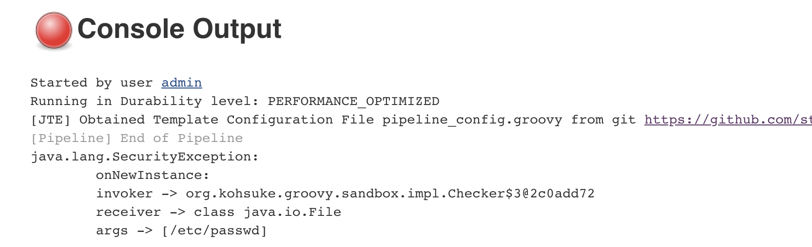

.. _sandboxing: 
----------
Sandboxing
----------

Jenkins Templating Engine ``pipeline_config.groovy`` configuration files are a custom DSL intent 
on making configuration as user friendly as possible. 

Due to the fact that these configuration files get executed as a script, their runtime is 
extremely sandboxed to allow little more than key/value setting. 

Attempting to do inappropriate things, like accessing the ``/etc/passwd`` file on the master, 
will result in a Security Exception being thrown. 

For example, the following configuration file:  

.. code:: 

    application_environments{
        dev{
            long_name = "Development" 
        }
    }

    password = new File("/etc/passwd").text 

would result in: 

