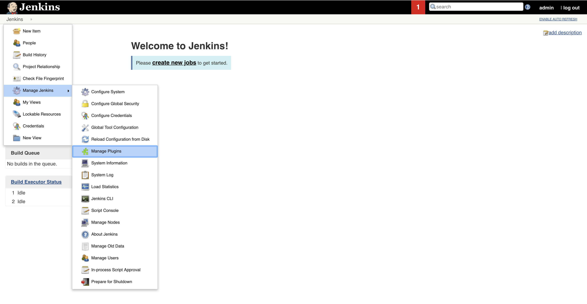
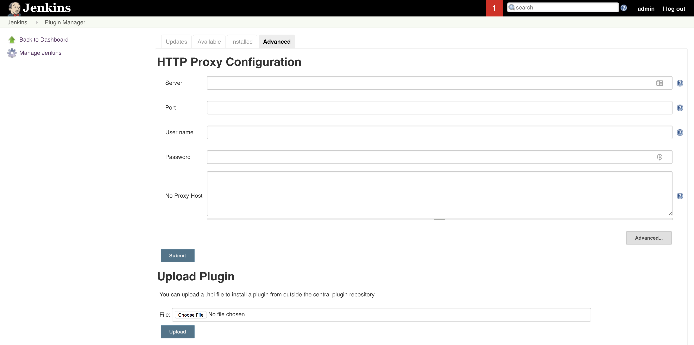
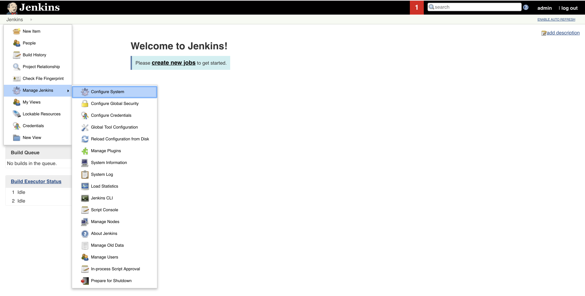
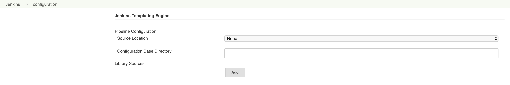

Installing the Plugin
=====================

.. important:: 
    The Jenkins Templating Engine plugin will soon be available in the Jenkins
    Update Center.  For now, the plugin can be built from source and uploaded
    manually through the UI or integrated into your Jenkins container image. 

Manual Installation
*******************

1. Navigate to the Jenkins Plugin Management Screen

2. Navigate to the Advanced Tab and upload the ``jte.jpi`` 

3. Restart Jenkins 

Docker Image Integration
************************

If you'd prefer to install the Jenkins Templating Engine plugin as part of your Jenkins docker 
image build you can do so by leveraging the `supported Jenkins image on Docker Hub`_. 

.. _`supported Jenkins image on Docker Hub`: https://hub.docker.com/r/jenkins/jenkins/

**Dockerfile:**

.. code:: 

    FROM jenkins/jenkins:lts
    EXPOSE 8080
    EXPOSE 50000

    # copy in custom jte plugin
    COPY jte.jpi /usr/share/jenkins/ref/plugins/jte.jpi

    # install plugins 
    COPY plugins.txt /usr/share/jenkins/ref/plugins.txt
    RUN /usr/local/bin/install-plugins.sh < /usr/share/jenkins/ref/plugins.txt

Validation
**********

You can validate the plugin has been installed successfully by navigating to ``Configure System``: 

and confirming there is a form section for ``Jenkins Templating Engine``

