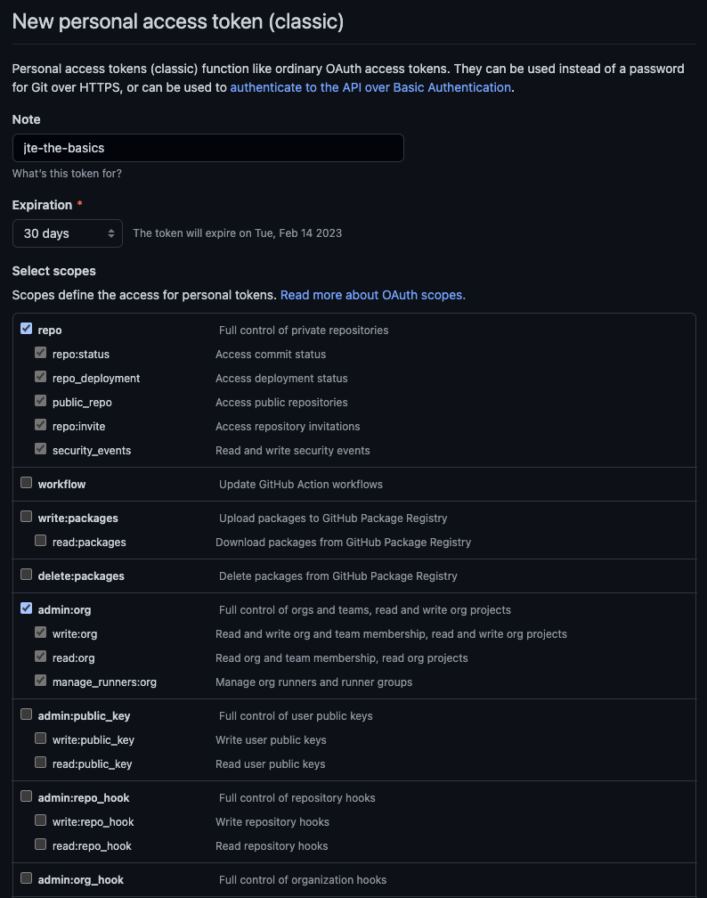
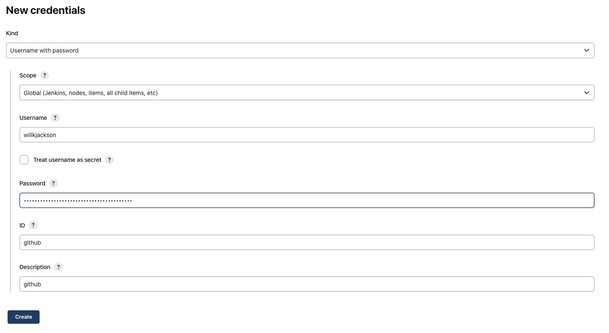
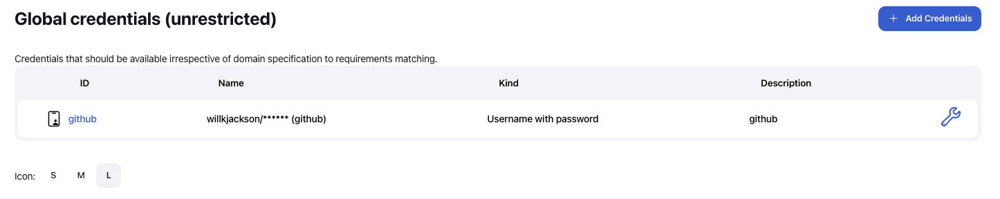

# Prerequisites

## Jenkins Instance

A Jenkins instance will be required for this lab. If you don't have one available to you, we would recommend going through the [Local Development](../local-development/index.md) Learning Lab to deploy a local Jenkins instance through Docker.

## Ability to Create GitHub Repositories

When creating your first set of Pipeline Libraries and externalizing the Pipeline Configuration from Jenkins you will need to be able to create GitHub repositories on [github.com](https://github.com).

!!! note
    Theoretically, any git-based SCM provider (Bitbucket, GitHub, GitLab, etc.) should integrate and work as expected with JTE. For the purposes of simplifying this lab, we will be using GitHub.

## GitHub PAT in the Jenkins Credential Store

!!! note
    If you intend to create public repositories then your PAT is merely acting to authenticate to GitHub in order to avoid rate limiting; you don't need to grant any scopes to the PAT.

    If you will be creating private repositories, you'll need to grant the `repo` scope to the PAT.

Create a [GitHub Personal Access Token (PAT)](https://help.github.com/en/github/authenticating-to-github/creating-a-personal-access-token-for-the-command-line). See the link for more specific directions.

* Click on your profile picture at the top-right of GitHub, then `Settings`, `Developer settings`, and `Personal access tokens`.
* Create a `Classic` token, don't use the `Fine-grained token` beta.
* Note/Name: `jte-the-basics`
* Select scope: `repo` (Full control of private repositories)
* Select scope: `admin:org` (Full control of GitHub organizations and teams, read and write organization projects)
* Leave all other scopes blank, click the `Generate token` button.

Copy this token and store it in the Jenkins credential store.

* From your Jenkins home page, click `Manage Jenkins` in the left-hand navigation menu.
* From your the Manage Jenkins page, click `Manage Credentials`.
* Select the `(global)` link under `Domains`.
* Click the `Add Credentials` button at the top right.
* Kind: `Username with password`
* Enter your GitHub username in the `Username` field.
* Paste the Personal Access Token into the `Password` field.
* Enter `github` into the `ID` field.
* Enter `github` into the `Description` field.
* Click `Create`.

You should see your new credential under the list of `Global credentials (unrestricted)`:

