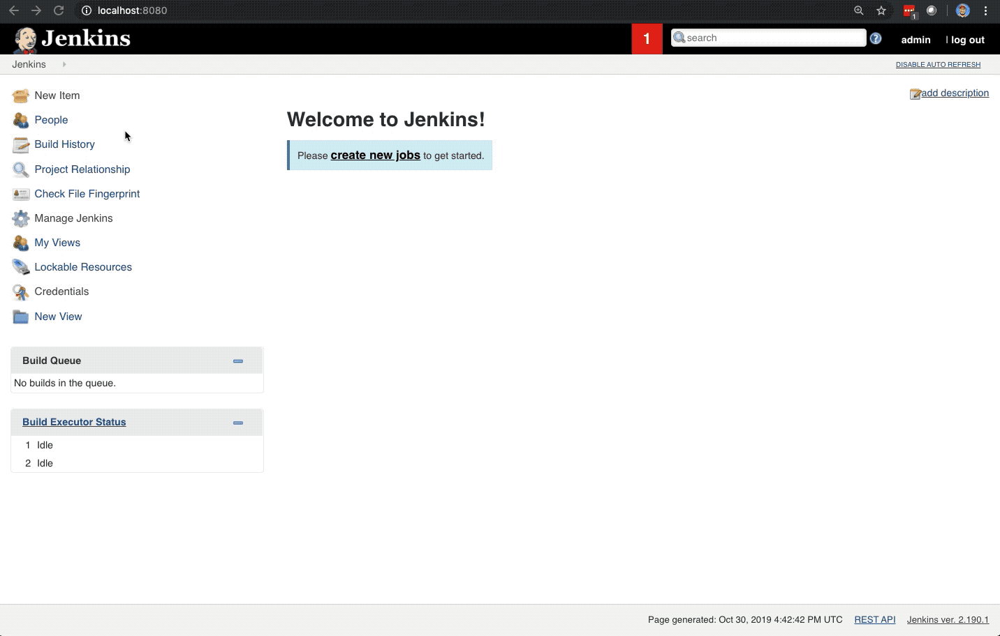

# Writing a Template

In JTE, instead of creating application-specific `Jenkinsfiles`, we create pipeline templates that represent the business logic of a pipeline in a tool-agnostic way.

## Create a Pipeline Job

To demonstrate this, first create a `Pipeline` job.

* From the Jenkins home page, navigate to `New Item` in the left-hand navigation menu.
* Enter an item name for the job to be created. You can use `single-job`.
* Select `Pipeline` from the list of available job types.
* Click `OK`.



## Write the Template

### Overview

For this lab, let's create a pipeline that can build an artifact with Maven and then perform static code analysis with SonarQube.

Scroll down on the job's configuration page to the `Pipeline` configuration section.

Make sure that `Jenkins Templating Engine` is selected in the `Definition` drop down configuration option.

Check the box for `Provide default pipeline template (Jenkinsfile)`.

In the `Jenkinsfile` text box, enter:

``` text
build()
static_code_analysis()
```

!!! note
    A word on vocabulary: The entire script above is called a *Pipeline Template*. Pipeline Templates invoke *steps*, in this case `build` and `static_code_analysis`, that are implemented by *libraries*.

You can click `Save` to save this configuration. In the next section we'll be creating the Pipeline Libraries that implement the `build` and `static_code_analysis` steps.
