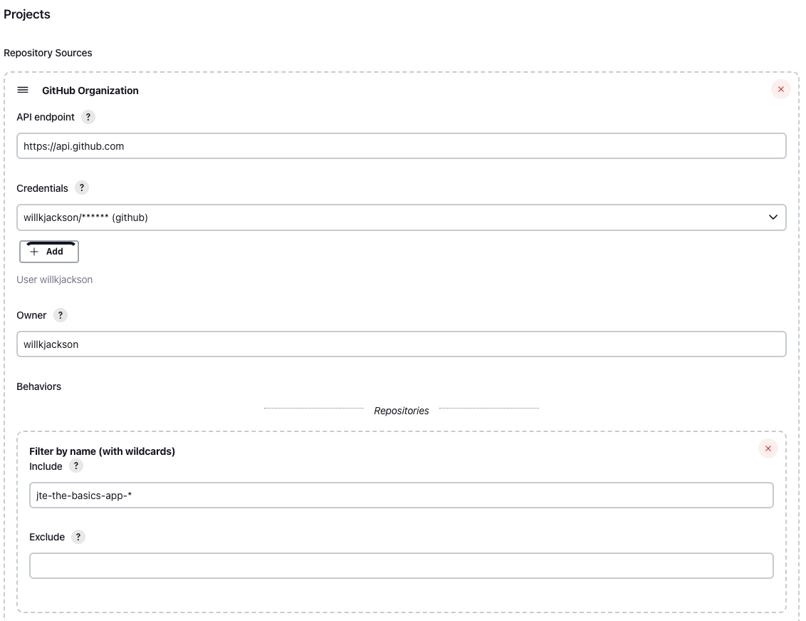
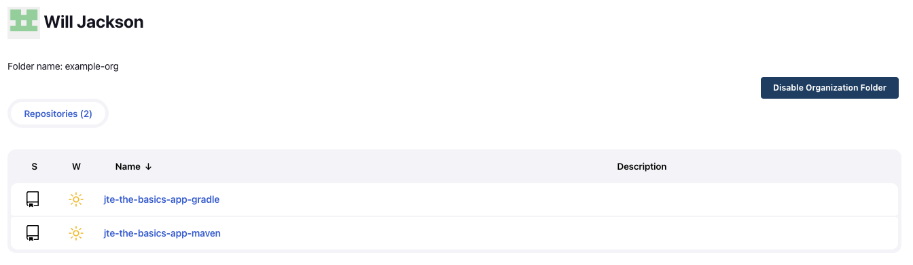

# Apply to Multiple GitHub Repositories

Next up, we'll see how to apply the same template to two different applications that are using different tools.

Let's walk through how you would setup JTE to this situation where one application is using Maven, the other application is using Gradle, and both applications are using SonarQube.

## Create a New GitHub Repository

We already have a Pipeline Configuration repository that has our Pipeline Template, Pipeline Configuration file, and Pipeline Libraries as well as a repository that represents an application using Gradle.

Follow the same procedure as before when creating the gradle application's repository to create a Maven application repository named `jte-the-basics-app-maven`.

## Modify the Pipeline Configurations

Now that there are multiple applications with some configurations that are common and some configurations that are unique, we need to introduce the concept of Pipeline Configuration aggregation.

### Modify the Governance Tier Configuration File

We need to edit the Pipeline Configuration file (`pipeline_config.groovy`) we created earlier to represent the *common* configurations that will be applied to both apps and explicitly *allow* these applications to add their own configurations.

Update the `pipeline_config.groovy` file in your library repository to this:

``` groovy title="./pipeline-configuration/pipeline_config.groovy"
@merge libraries {
    sonarqube 
}
```

!!! note
    In this configuration, both applications are using SonarQube. Since this is a common configuration, we'll leave it in the Governance Tier's configuration file.

    The application repositories will each get their own `pipeline_config.groovy` to indicate if they are using the `maven` or the `gradle` library.

    Since we want to allow these apps to add _additional_ configurations, we need to be explicit about that by annotating the `libraries` block with `@merge` in the Pipeline Configuration.

    Push this change to the `main/master` branch of your library repository.

!!! important
    When aggregating Pipeline Configurations, JTE applies *conditional inheritance* during the aggregation process.

### Create a Pipeline Configuration File for the Maven Application

In the `jte-the-basics-app-maven` repository we just created, add a `pipeline_config.groovy` file at the root that specifies you want to load the `maven` library:

``` groovy title="jte-the-basics-app-maven/pipeline_config.groovy"
libraries {
    maven
}
```

!!! note
    Since this application will inherit the global configurations defined in the Governance Tier, we don't have to duplicate the configuration of loading the `sonarqube` library in the repo-level Pipeline Configuration.

### Create a Pipeline Configuration File for the Gradle Application

In the `jte-the-basics-app-gradle` repository we created earlier for the Multibranch Project, add a `pipeline_config.groovy` file at the root that specifies you want to load the `gradle` library:

``` groovy title="jte-the-basics-app-gradle/pipeline_config.groovy"
libraries {
    gradle
}
```

!!! important
    Push both changes to both repos in the `main/master` branch. You can delete the `test` branch you created in the Gradle repo earlier.

## Create a GitHub Organization Project

We created a `Multibranch Project` that automatically created jobs for every branch and Pull Request in a repository.

Now, we'll create a `GitHub Organization Project` that can automatically create `Multibranch Projects` for every repository within a GitHub Organization.

* From the Jenkins home page, select `New Item` in the left-hand navigation menu.
* Select a name for the job: `example-org`, it will be renamed with your organization (your username).
* Select `Organization Folder` then click `OK`.
* Under `Repository Sources`, add a `GitHub Organization`.
* Enter `https://api.github.com` as the API endpoint, or leave it blank if you can't fill it in.
* Select the `github` credential under the `Credentials` drop-down menu.
* Enter your GitHub username under the `Owner` field.
* Under `Behaviors` click `Add` then under `Repositories` (not to be confused with `Within Repositories`), select `Filter by name (with wildcards)`.
* Enter `jte-the-basics-app-*` in the `Include` text box (assuming you've following the naming recommendations of the application repositories).
* Under `Project Recognizers` hit the red X to delete the `Pipeline Jenkinsfile` Recognizer.
* Under `Project Recognizers` select `Add` and click `Jenkins Templating Engine`.
* Click `Save`.



After creating the GitHub Organization job in Jenkins, you will be redirected to the logs of the GitHub Organization being scanned to find repositories that match the wildcard format entered during job creation. This will scope the repositories for which jobs are created to just this lab's application repositories.

Once scanning has finished, go view the GitHub Organization's job page in Jenkins and you will see two Multibranch Projects have been created for `jte-the-basics-app-gradle` and `jte-the-basics-app-maven`.

Explore each of these jobs to see that the `gradle` repository's pipeline loaded the `gradle` library and the `maven` repository loaded the `maven` library and both pipelines loaded the `sonarqube` library.



!!! important
    We just created a configuration where *multiple* applications used the *same* pipeline template, shared a common configuration, but still have the flexibility to choose the correct build tool for their application!
