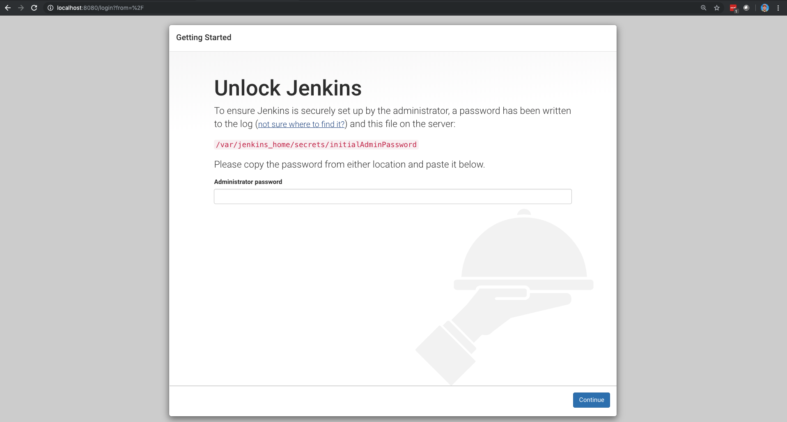

# Running the Jenkins Container

Docker simplifies packaging applications with all their dependencies.

Through Docker, we can have a running Jenkins instance in a matter of seconds.

In your terminal, first build a Jenkins image with docker installed. Create a `Dockerfile` in an empty directory with the following:

``` text
FROM jenkins/jenkins:lts
USER root
RUN apt-get update && apt-get install -y \
    apt-transport-https \
    ca-certificates \
    curl \
    gnupg-agent \
    software-properties-common
RUN curl -fsSL https://download.docker.com/linux/debian/gpg | apt-key add
RUN add-apt-repository \
   "deb [arch=amd64] https://download.docker.com/linux/debian \
   $(lsb_release -cs) \
   stable"
RUN apt-get update && apt-get install -y docker-ce docker-ce-cli containerd.io 
EXPOSE 8080
```

From the same directory as your Dockerfile, build the image:

``` text
docker build -t jenkins:lts-docker .
```

!!! note
    Running Jenkins as a docker container on a BAH-managed machine requires specific certificates and tooling to be installed. A Dockerfile meeting these requirements can be built from the [solutions-delivery-platform/bah-jenkins](https://github.boozallencsn.com/solutions-delivery-platform/bah-jenkins) repository.

Then, to start Jenkins, run:

On Linux or Mac:

``` text
    docker run --name jenkins \
    -v /var/run/docker.sock:/var/run/docker.sock \
    --privileged \
    --user root \
    -p 50000:50000 \
    -p 8080:8080 \
    -d \
    jenkins:lts-docker
```

On Windows:

```text
    docker run --name jenkins \
    -v //var/run/docker.sock:/var/run/docker.sock  \
    --privileged \
    --user root \
    -p 50000:50000 \
    -p 8080:8080 \
    -d \
    jenkins:lts-docker
```

## Command Line Breakdown

| Command Section          | Description                                                                                                   |
|--------------------------|---------------------------------------------------------------------------------------------------------------|
| `docker run` | Tells Docker to run a command in a new container. |
| `--name jenkins` | Names the container being launched `jenkins`. This is done for ease of referencing it later. |
| `-v /var/run/docker.sock:/var/run/docker.sock` | Mounts the local Docker daemon socket to the Jenkins container. |
| `–-privileged` | Escalates the container permissions so it can launch containers on the host docker daemon. |
| `–-user root` | Runs the container as the root user so it can launch containers on the host docker daemon. |
| `-p 50000:50000` | Port forwarding of the default JNLP agent port to our localhost. |
| `-p 8080:8080` | Port forwarding of the Jenkins port to our localhost. |
| `-d` | Runs the container process in the background. |
| `jenkins:lts-docker` | The container image from which to run this container. |

!!! note
    If port 8080 is already in use by another process then this command will fail. To run Jenkins on a different port, swap out the first 8080 to your desired port: ``<desired port number>:8080``.

You can run ``docker logs -f jenkins`` to see the Jenkins logs. It will say "Jenkins is fully up and running" when Jenkins is ready.

You can validate the container launched as expected by going to ``http://localhost:8080``.

You should see the Jenkins Startup Wizard:



In the next section, we'll learn how to get past this Startup Wizard and configure the newly deployed Jenkins instance.
