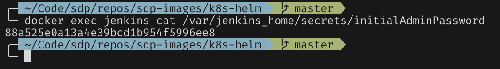
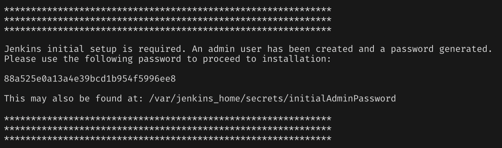
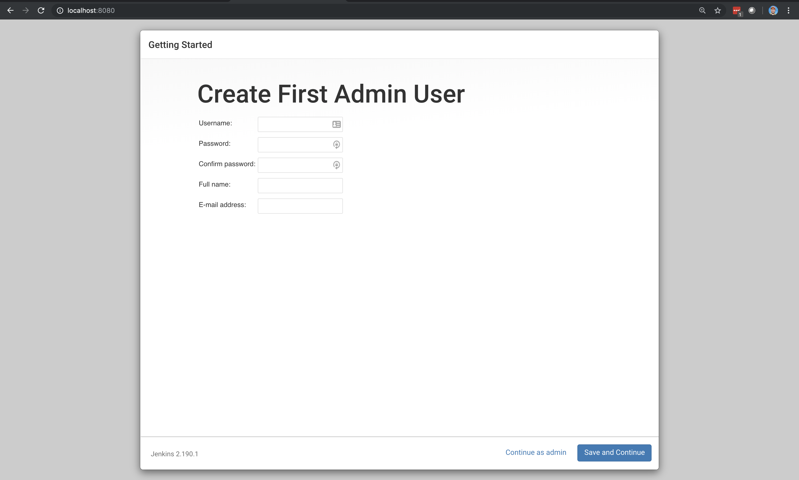
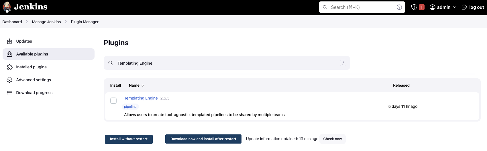
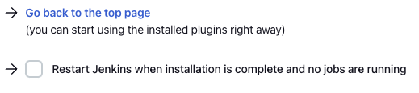

# Configuring Jenkins

In the last section, we ran a local Jenkins instance via Docker and validated that it's running on `http://localhost:8080`.

Now, we're going to configure that Jenkins instance by:

* Entering the initial admin password
* Installing the default suggested plugins
* Installing the Jenkins Templating Engine
* Installing the Docker Pipeline plugin

## Initial Admin Password

There are _two_ ways to get the initial admin password for Jenkins.

### 1. From the initialAdminPassword file

The initial admin password is stored in `/var/jenkins_home/secrets/initialAdminPassword` within the container.

You can print this password in your terminal by running: `docker exec jenkins cat /var/jenkins_home/secrets/initialAdminPassword`. You should see something similar to this:

Copy and paste this password into the _Administrator password_ text box in Jenkins.

### 2. From the container log output

The initial admin password is also printed to standard out while Jenkins starts up. To view the Jenkins logs, run `docker logs jenkins`.

In the output, you should see something similar to this:

Copy and paste the password into the text box in Jenkins.

## Installing the Suggested Plugins

After entering the initial admin password, Jenkins will bring you to a _Customize Jenkins_ page.

Click the `Install suggested plugins` button.

This will bring you to a loading screen displaying the progress as Jenkins installs the most popular community plugins. The process takes less than five minutes.

## Setup Initial Admin User

After the plugins are done installing, Jenkins will send you to a screen to configure the default admin user:

Feel free to create a custom username and password or continue as admin; no one will use this test Jenkins installation except you.

!!! important
    If you click "continue as admin" then the username will be `admin` and the password will be the initial admin password we found earlier. If you change your admin user/password to something else you will need to remember it.

## Instance Configuration

After creating the initial admin user, Jenkins will send you to a screen where you can configure the instance's URL. The text box will be pre-populated with what's currently in your browser, so click _Save and Finish_ in the bottom right-hand side of the screen.

Then click "_Start Using Jenkins_" and you will be directed to the Jenkins home page:

## Installing the Jenkins Templating Engine

At this point, you've completed the Jenkins Startup Wizard process.

Now, we're going to install the Jenkins Templating Engine, which can be found as the `Templating Engine Plugin` in the Plugin Manager.

* In the left-hand navigation menu, select _Manage Jenkins_.
* In the middle of the screen, select _Manage Plugins_.
* In the left-hand navigation menu, select _Available plugins_.
* In the _Search available plugins_ text box, type: `Templating Engine`

At this point you should see:

Make sure to select the `Templating Engine` checkbox and click the "_Download now and install after restart_" button.

This will direct you to a screen showing the download progress of JTE.

Scroll to the bottom of the `Download progress` screen and select "_Restart Jenkins when installation is complete and no jobs are running_."

At this point, Jenkins will restart automatically. Log in again with either the custom admin user you created earlier or the initial admin password.

!!! important
    You can run `docker logs -f jenkins` to see the Jenkins logs. It will say "Jenkins is fully up and running" somewhere in the logs (with a timestamp) when Jenkins has completed the restart and is ready to be interacted with.

## Installing the Docker Pipeline plugin

Now, we need to install the Docker Pipeline plugin, which can be found as the `Docker Pipeline` in the Plugin Manager.

* In the left-hand navigation menu, select _Manage Jenkins_.
* In the middle of the screen, select _Manage Plugins_.
* In the left-hand navigation menu, select _Available plugins_.
* In the _Search available plugins_ text box, type: `Docker Pipeline`

Follow the same steps used for installing the Jenkins Templating Engine and restart the Jenkins instance.
