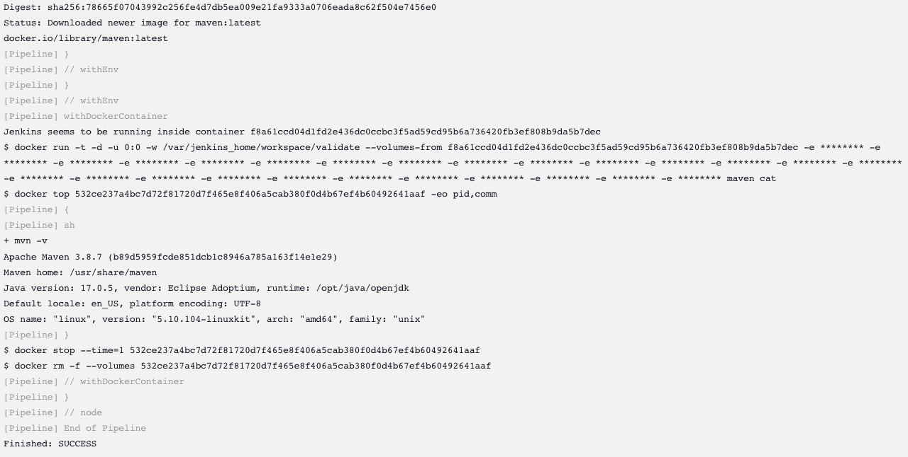

# Validate Jenkins

That's it! You've now deployed and configured a local Jenkins instance.

We're going to run through a couple quick steps to ensure that the deployed Jenkins can launch containers as part of the pipeline.

## Create a Pipeline Job

* From the Jenkins home page, select _New Item_ in the left-hand navigation menu.
* Enter a name for the job. "validate" will do.
* Select the _Pipeline_ job type.
* Click the _OK_ button at the bottom of the screen.

## Configure a Pipeline

* Scroll down to the _Pipeline_ Configuration section.
* The _Definition_ drop down should already be set to _Jenkins Templating Engine_.

!!! important
    This confirms that JTE has been installed successfully!

* Check the box "Provide a pipeline template (Jenkinsfile)".
* In the _Jenkinsfile_ text box, enter:

``` text
docker.image("maven").inside{
    sh "mvn -v" 
}
```

!!! note
    This Jenkinsfile pulls the latest `maven` image from Docker Hub and executes the command ``mvn -v`` within that container image.

    This will validate that your local Jenkins can pull container images, run them, and then execute pipeline commands inside the launched container.


* Click the _Save_ button at the bottom of the screen.
* This will redirect you back to the job's main page. Click _Build Now_ in the left-hand navigation menu.
* Under _Build History_ select _#1_ to navigate to the Build page.
* In the left-hand navigation menu, select _Console Output_ to read the build logs.
* Confirm that the pipeline successfully pulled the `maven` container image.
* Confirm that the command `mvn -v` executed successfully and shows the Maven version.
* Validate that the build finished successfully.

If all went well, the console output should show something like:


